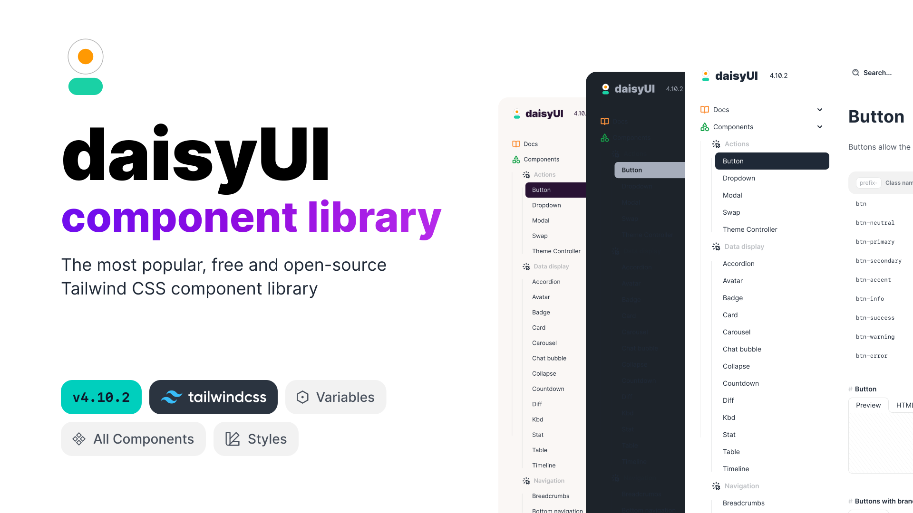

**🚀 daisyUI + Angular = Beautiful, Simple, Fast components**

<h1>daisyng</h1>
<h3>Angular UI Component Library</h3>

## Documentation

Check out our [Documentation]() for detailed instructions, examples, and guidelines on how to integrate and use components in your Angular apps.

## Contribution

Yes please! See the
[contributing guidelines]()
for details. a comprehensive guide and API reference, visit our [Documentation]() page.

## License

This project is licensed under the terms of the
[MIT license]().

From 🇺🇦 With ❤️
